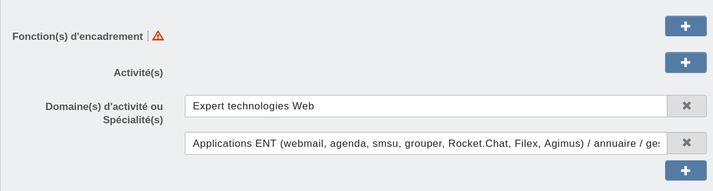

# Exemples

* [Cabine photographique](#cabine-photographique)
* [Homonymes](#homonymes)
* [Champs multi-valués](#champs-multi-valués)
* [Champs conditionnels](#champs-conditionnels)
* [Divers](#divers)

## Cabine photographique

[](https://raw.githubusercontent.com/UnivParis1/comptex/master/docs/exemples/photobooth.webp)

```typescript
jpegPhoto: { title: "Photo", format: 'image/jpeg', uiType: 'cameraSnapshot' },
```

## Homonymes

Présentation des homonymes trouvés :


Après clic sur « C'est la même personne » le workflow continue avec un message d'avertissement :


```typescript
attrs: {
    global_main_profile: {  toUserOnly: true, uiHidden: true },
    uid: { uiType: 'homonym', optional: true },
},
```

## Champs multi-valués



```typescript
attrs: {
    info: {
        title: "Domaine(s) d'activité ou Spécialité(s)",
        uiOptions: { title_rowspan: true },
        items: {},
        optional: true,
        cond_overrides: { 'not_staff|faculty|teacher': null },
    },
},
```

## Champs conditionnels

Selon le choix « Demander à l'invité de remplir » ou « Remplir moi-même »


```typescript
attrs: {
    ask_extern: {
        title: "Informations personnelles",
        oneOf: [ 
            { const: "yes", title: "Demander à l'invité de remplir", 
                merge_patch_parent_properties: {  
                    supannMailPerso: {  
                        title: "Email de la personne", 
                        description: "<br>Un mél va être envoyé à l'invité lui demandant de remplir ses informations personnelles (nom, prénom, date de naissance, coordonnées).", 
                    }, 
                    } }, 
            { const: "no", title: "Remplir moi-même",  
                merge_patch_parent_properties: perso_attrs }, 
        ],
    },
},
```

## Divers


