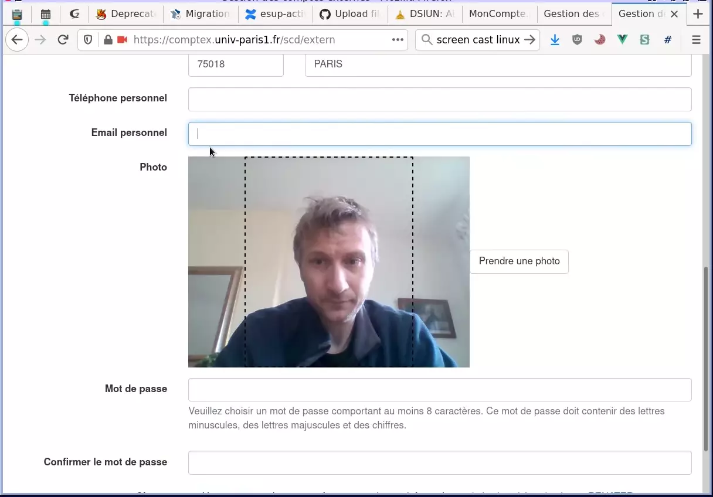
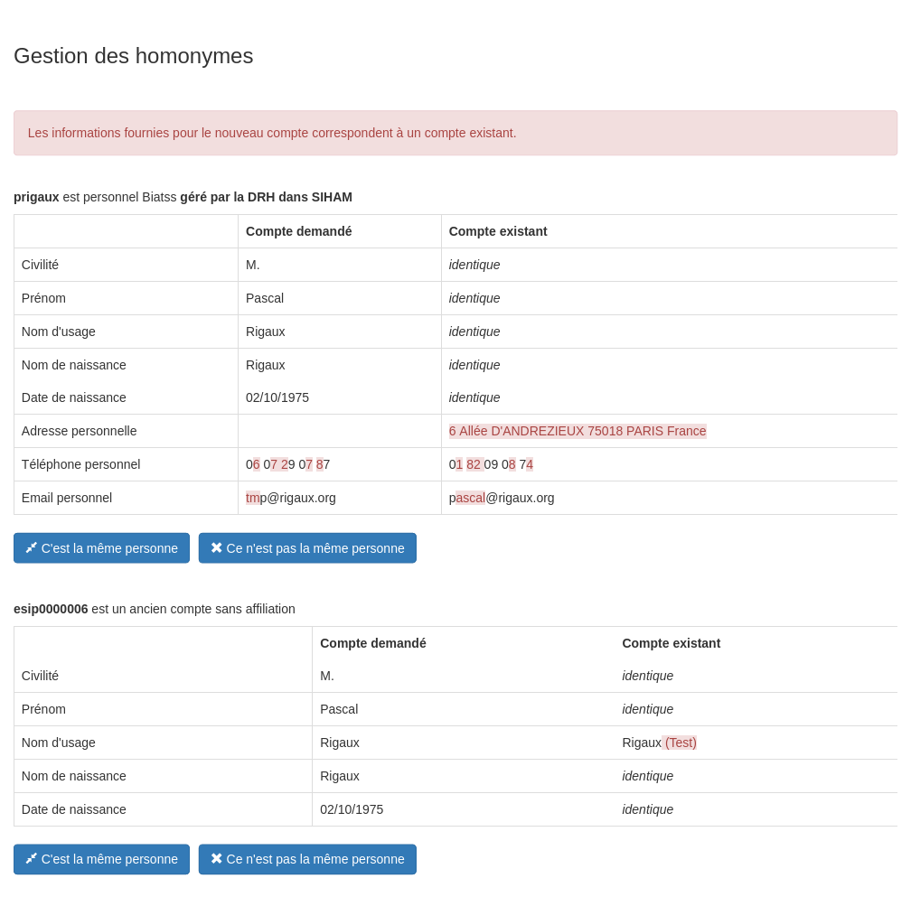
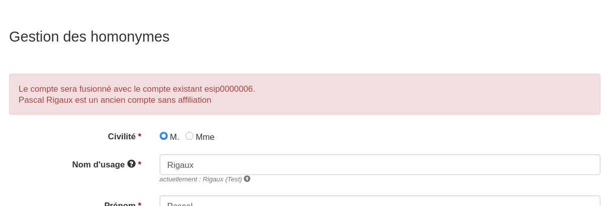
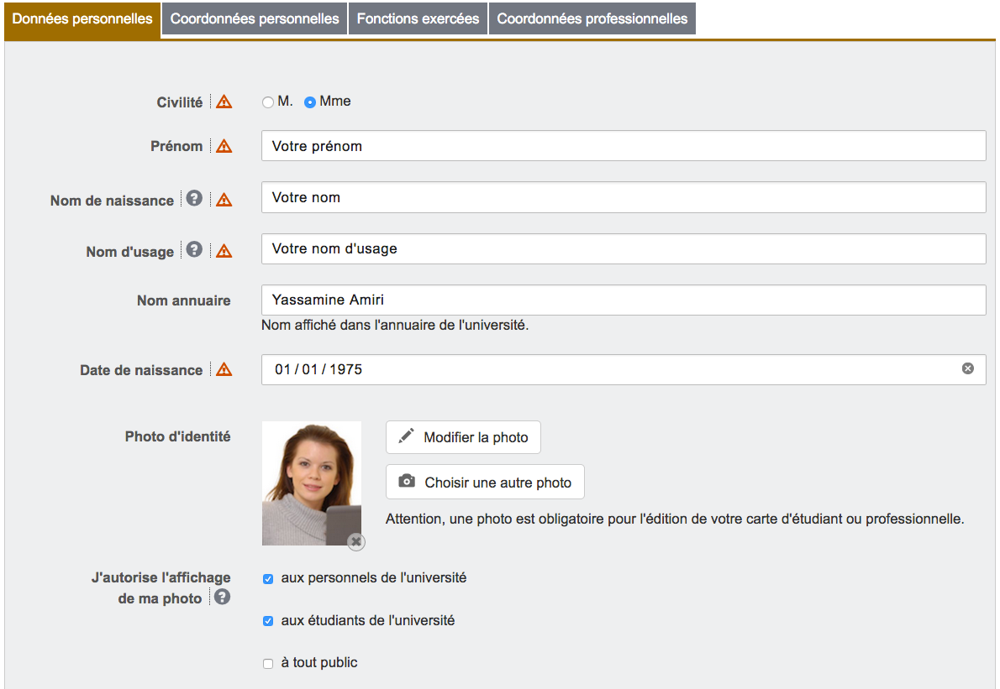
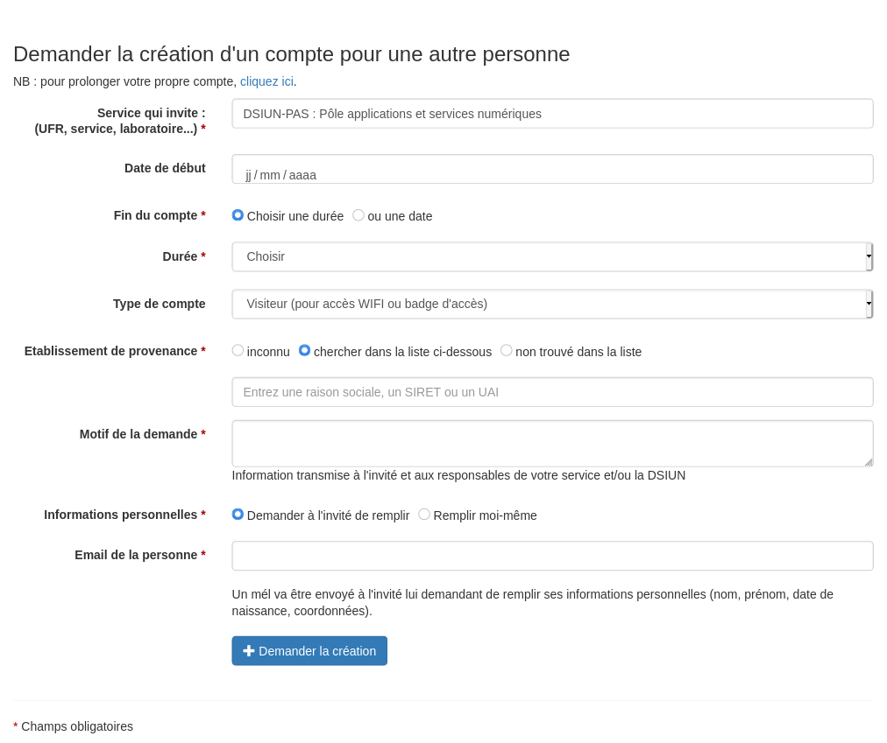
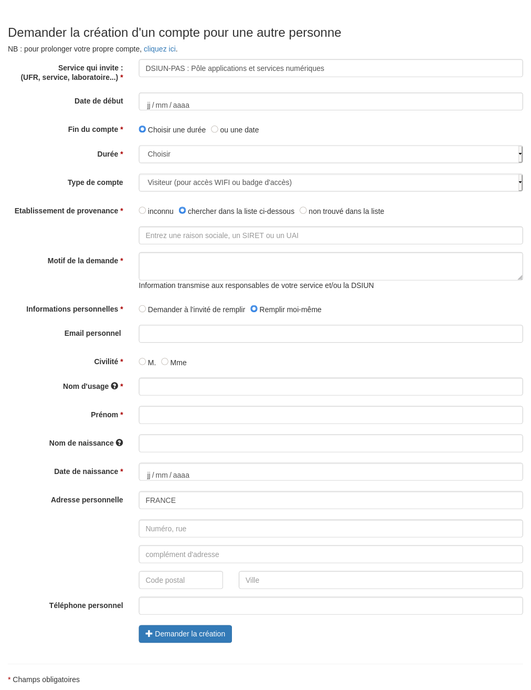

# Exemples

* [Cabine photographique](#cabine-photographique)
* [Homonymes](#homonymes)
* [Divers](#divers)
* [Champs conditionnels](#champs-conditionnels)

## Cabine photographique

[](https://raw.githubusercontent.com/UnivParis1/comptex/master/docs/exemples/photobooth.webp)

## Homonymes

* Présentation des homonymes trouvés :


* Après clic sur « C'est la même personne » le workflow continue avec un message d'avertissement :


## Divers



## Champs conditionnels

Selon le choix « Demander à l'invité de remplir » ou « Remplir moi-même »



```typescript
        oneOf: [ 
            { const: "yes", title: "Demander à l'invité de remplir", 
              merge_patch_parent_properties: {  
                  supannMailPerso: {  
                      title: "Email de la personne", 
                      description: "<br>Un mél va être envoyé à l'invité lui demandant de remplir ses informations personnelles (nom, prénom, date de naissance, coordonnées).", 
                  }, 
                 } }, 
            { const: "no", title: "Remplir moi-même",  
              merge_patch_parent_properties: perso_attrs }, 
        ],
```